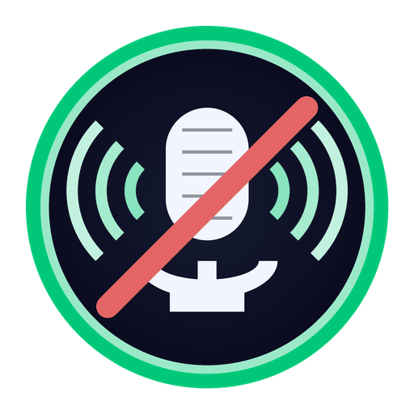

<p align="center">
  
</p>

<h1 align="center">NoiseClear</h1>

<p align="center">
  <strong>Real-time noise cancellation for Windows</strong><br/>
  Crystal-clear voice in Zoom, Discord, Google Meet, Microsoft Teams, and any app of choice.
</p>

<p align="center">
  
  
  
  
</p>

---

## What is NoiseClear?

NoiseClear is a lightweight, real-time noise cancellation app for Windows. It sits between your microphone and your communication apps, removing background noise (keyboard clicks, fans, traffic, etc.) before your voice reaches Zoom, Discord, Google Meet, or any other app.

It works by routing audio through a virtual audio cable:

```
Your Mic  -->  NoiseClear (removes noise)  -->  Virtual Cable  -->  Zoom / Discord / Meet
```

### Key Features

- **Real-time processing** - Sub-10ms latency with lock-free audio pipeline
- **3 noise engines** - Spectral Gate (built-in), RNNoise (lightweight AI), DeepFilter (high-quality AI)
- **Adjustable strength** - Fine-tune noise reduction from subtle to aggressive
- **Live audio meters** - See input/output levels in real time
- **System tray** - Minimize to tray, toggle from tray menu
- **Auto-detection** - Finds VB-CABLE / VoiceMeeter automatically
- **Dark UI** - Modern dark theme built with CustomTkinter

---

## Screenshots

```
+---------------------------------------+
|          NoiseClear v1.0              |
|---------------------------------------|
|                                       |
|         [ ON ]  (green button)        |
|    Noise Cancellation Active          |
|                                       |
|    IN [||||||||    ]  -12.3 dB        |
|   OUT [||||||      ]  -18.1 dB        |
|                                       |
|    Strength: ====O========  70%       |
|    Engine:   [Spectral Gate  v]       |
|                                       |
|---------------------------------------|
|  Input:  [Microphone (Realtek) v]     |
|  Output: [CABLE Input (VB-Audio) v]   |
|           [Refresh Devices]           |
+---------------------------------------+
```

---

## Quick Start

### 1. Install a Virtual Audio Cable

You need one of these (free options available):

| Software | Link | Notes |
|----------|------|-------|
| **VB-CABLE** | [vb-audio.com/Cable](https://vb-audio.com/Cable/) | Free, lightweight |
| **VoiceMeeter** | [vb-audio.com/Voicemeeter](https://vb-audio.com/Voicemeeter/) | Free, more features |

### 2. Install NoiseClear

```bash
# Clone the repository
git clone https://github.com/yourusername/NoiseClear.git
cd NoiseClear

# Install dependencies
pip install -r requirements.txt

# Run
python main.py
```

### 3. Configure Your Apps

In Zoom / Discord / Google Meet, set your **microphone** to:
- `CABLE Output (VB-Audio Virtual Cable)` if using VB-CABLE
- `VoiceMeeter Output` if using VoiceMeeter

That's it. NoiseClear handles the rest.

---

## Architecture

### High-Level Overview

```
                    +-------------------+
                    |    AppWindow      |  UI Layer (CustomTkinter)
                    |   (Main Thread)   |
                    +--------+----------+
                             |
              +--------------+--------------+
              |              |              |
     +--------v---+  +------v------+  +----v-------+
     | MainPanel  |  |DeviceSelect |  | TrayIcon   |
     | - Toggle   |  | - Input     |  | - Menu     |
     | - Meters   |  | - Output    |  | - Toggle   |
     | - Strength |  | - Refresh   |  | (Thread)   |
     | - Engine   |  +------+------+  +----+-------+
     +--------+---+         |              |
              |              |              |
              +--------------+--------------+
                             |
                    +--------v----------+
                    |   AudioPipeline   |  Core Audio Engine
                    |  (Process Thread) |
                    +--------+----------+
                             |
              +--------------+--------------+
              |                             |
     +--------v---------+        +---------v--------+
     |   Input Stream   |        |  Output Stream   |
     | (PortAudio CB)   |        | (PortAudio CB)   |
     | -> Input Ring    |        | <- Output Ring   |
     +--------+---------+        +---------+--------+
              |                             ^
              v                             |
     +--------+-----------------------------+--------+
     |              Processing Thread                 |
     |  Input Ring --> NoiseProcessor --> Output Ring  |
     +------------------------------------------------+
```

### Threading Model

NoiseClear uses a carefully designed multi-threaded architecture for real-time audio:

```
+------------------+     +---------------------+     +------------------+
|   Main Thread    |     |  Processing Thread  |     |   Tray Thread    |
|                  |     |                     |     |                  |
| - CustomTkinter  |     | - Read input ring   |     | - pystray icon   |
| - UI updates     |     | - Run denoiser      |     | - System tray    |
| - Event loop     |     | - Write output ring |     |   menu           |
| - 30fps meters   |     | - Update meters     |     |                  |
+------------------+     +---------------------+     +------------------+
                                  ^   |
                                  |   v
                          +-------+---+-------+
                          |                   |
                   +------+------+    +-------+-----+
                   | Input Ring  |    | Output Ring  |
                   |  Buffer     |    |  Buffer      |
                   | (lock-free) |    | (lock-free)  |
                   +------+------+    +-------+-----+
                          ^                   |
                          |                   v
                   +------+------+    +-------+-----+
                   | PortAudio   |    | PortAudio   |
                   | Input CB    |    | Output CB   |
                   | (RT Thread) |    | (RT Thread) |
                   +-------------+    +-------------+
```

**Key design decisions:**
- **Lock-free ring buffers** between real-time PortAudio callbacks and the processing thread (no mutexes in audio path)
- **Single-producer single-consumer (SPSC)** ring buffers avoid contention
- **Processing thread** runs independently at its own pace, decoupled from audio callbacks
- **UI updates at 30fps** via tkinter `after()` timer, never blocking audio

### Audio Processing Pipeline

```
Microphone
    |
    v
[PortAudio Input Callback]  <-- Real-time thread, ~10ms intervals
    |
    | write (lock-free)
    v
[Input Ring Buffer]  <-- 48000 samples = 1 second capacity
    |
    | read (lock-free)
    v
[Processing Thread Loop]
    |
    +---> [LevelMeter: Input]  --> UI (input dB display)
    |
    v
[NoiseProcessor.process_frame()]
    |
    | 480 samples (10ms) per frame
    v
    +---> [LevelMeter: Output]  --> UI (output dB display)
    |
    | write (lock-free)
    v
[Output Ring Buffer]  <-- 48000 samples = 1 second capacity
    |
    | read (lock-free)
    v
[PortAudio Output Callback]  <-- Real-time thread
    |
    v
Virtual Cable Input
    |
    v
Zoom / Discord / Meet  (reads from "CABLE Output")
```

### Noise Processing Engines

```
+-------------------+
| NoiseProcessor    |  <-- Abstract Base Class (ABC)
| (base_processor)  |
+---+--------+------+
    |        |        \
    v        v         v
+--------+ +-------+ +-----------+
|Spectral| |RNNoise| |DeepFilter |
| Gate   | |       | |           |
+--------+ +-------+ +-----------+

Engine Comparison:
+---------------+------------+----------+---------+-------------+
| Engine        | Quality    | CPU Load | Latency | Requires    |
+===============+============+==========+=========+=============+
| Spectral Gate | Good       | Low      | ~100ms  | noisereduce |
| RNNoise       | Very Good  | Low      | ~10ms   | pyrnnoise   |
| DeepFilter    | Excellent  | High     | ~100ms  | torch + df  |
+---------------+------------+----------+---------+-------------+
```

#### Spectral Gate (Default)

The built-in engine using `noisereduce` with non-stationary spectral gating:

```
Input frames (10ms each)
    |
    v
[Accumulator]  -- collects until 100ms chunk
    |
    | 4800 samples (100ms)
    v
[noisereduce.reduce_noise()]
    |
    | Spectral analysis + gating
    v
[Overlap-Add with Hann Window]
    |
    | 20ms overlap for smooth crossfades
    v
[Output Buffer (deque)]
    |
    | dispense 480 samples per call
    v
Output frames (10ms each)
```

#### RNNoise (Optional)

Lightweight recurrent neural network, processes natively at 10ms:

```
Input frame (480 samples, 10ms)
    |
    v
[float32 -> int16 conversion]
    |
    v
[RNNoise neural network]  <-- Stateful RNN
    |
    v
[int16 -> float32 conversion]
    |
    v
[Blend: strength * processed + (1-strength) * original]
    |
    v
Output frame (480 samples, 10ms)
```

#### DeepFilter (Optional)

High-quality deep learning model using PyTorch:

```
Input frames (10ms each)
    |
    v
[Accumulator]  -- collects until 100ms chunk
    |
    v
[DeepFilterNet enhance()]  <-- Stateful STFT + RNN
    |
    v
[Blend with original based on strength]
    |
    v
Output frames (10ms each)
```

### Module Dependency Graph

```
main.py
  |
  +-- config/
  |     +-- settings.py          Settings (JSON persistence)
  |
  +-- audio/
  |     +-- device_manager.py    DeviceManager (enumerate + monitor)
  |     +-- audio_pipeline.py    AudioPipeline (core engine)
  |     +-- ring_buffer.py       RingBuffer (lock-free SPSC)
  |     +-- level_meter.py       LevelMeter (RMS/peak calc)
  |
  +-- processing/
  |     +-- base_processor.py    NoiseProcessor (ABC)
  |     +-- spectral_gate_processor.py  (noisereduce)
  |     +-- rnnoise_processor.py        (pyrnnoise, optional)
  |     +-- deepfilter_processor.py     (torch + df, optional)
  |     +-- processor_factory.py ProcessorFactory
  |
  +-- ui/
        +-- app_window.py        AppWindow (root window)
        +-- main_panel.py        MainPanel (controls)
        +-- device_selector.py   DeviceSelector (dropdowns)
        +-- level_meter_widget.py LevelMeterWidget (canvas)
        +-- tray_icon.py         TrayIcon (pystray)
        +-- theme.py             COLORS, FONTS constants
```

### Settings Persistence

```
%APPDATA%/Roaming/NoiseClear/settings.json
{
    "input_device_name": "Microphone (Realtek Audio)",
    "output_device_name": "CABLE Input (VB-Audio)",
    "noise_reduction_strength": 0.7,
    "engine": "spectral_gate",
    "sample_rate": 48000,
    "frame_size": 480,
    "noise_cancellation_enabled": true,
    "minimize_to_tray": true
}
```

---

## Project Structure

```
noise-canceller/
+-- main.py                  Application entry point
+-- tests.py                 Test suite (40 tests)
+-- requirements.txt         Python dependencies
+-- requirements-deepfilter.txt  Optional DeepFilter deps
+-- generate_icon.py         Logo/icon generator script
+-- create_shortcuts.py      Windows shortcut creator
+-- NoiseClear.spec          PyInstaller build spec
+-- icon.ico                 Multi-resolution app icon
+-- icon.png                 256px PNG icon
+-- assets/
|   +-- logo.png             512px logo for README
+-- config/
|   +-- settings.py          Settings management
+-- audio/
|   +-- ring_buffer.py       Lock-free SPSC ring buffer
|   +-- level_meter.py       Audio level metering
|   +-- device_manager.py    Audio device enumeration
|   +-- audio_pipeline.py    Core audio routing engine
+-- processing/
|   +-- base_processor.py    Abstract processor interface
|   +-- spectral_gate_processor.py  Default engine
|   +-- rnnoise_processor.py Optional RNNoise engine
|   +-- deepfilter_processor.py Optional DeepFilter engine
|   +-- processor_factory.py Engine factory + detection
+-- ui/
|   +-- theme.py             Color/font theme constants
|   +-- level_meter_widget.py Audio meter canvas widget
|   +-- device_selector.py   Input/output device picker
|   +-- main_panel.py        Main control panel
|   +-- tray_icon.py         System tray integration
|   +-- app_window.py        Root application window
+-- build/                   PyInstaller build output
+-- dist/                    Distributable executable
```

---

## Installation

### Requirements

- **Python 3.10+**
- **Windows 10/11**
- **Virtual Audio Cable** (VB-CABLE or VoiceMeeter)

### Core Dependencies

```bash
pip install -r requirements.txt
```

| Package | Purpose |
|---------|---------|
| `sounddevice` | PortAudio bindings for audio I/O |
| `numpy` | Audio buffer operations |
| `noisereduce` | Spectral Gate noise reduction |
| `scipy` | Signal processing (FFT, windowing) |
| `customtkinter` | Modern dark-themed UI |
| `pystray` | System tray integration |
| `Pillow` | Icon generation and tray icon |

### Optional: RNNoise Engine

```bash
pip install pyrnnoise
```

### Optional: DeepFilter Engine

```bash
pip install -r requirements-deepfilter.txt
# Installs: torch, torchaudio, deepfilternet
```

---

## Usage

### Running from Source

```bash
python main.py
```

### Building a Standalone Executable

```bash
pip install pyinstaller
pyinstaller NoiseClear.spec
```

The executable will be in `dist/NoiseClear/NoiseClear.exe`.

### Creating Desktop Shortcuts (Post-Build)

```bash
python create_shortcuts.py
```

---

## Testing

Run the full test suite:

```bash
python tests.py
```

### Test Coverage

| Category | Tests | Description |
|----------|-------|-------------|
| Config & Settings | 3 | Load defaults, save/reload, corrupt file handling |
| Ring Buffer | 7 | Read/write, wraparound, overflow, clear, partial read |
| Level Meter | 4 | Silence, full scale, decay, reset |
| Device Manager | 8 | Discovery, naming, search, virtual cable, refresh |
| Noise Processors | 6 | Init, processing, energy reduction, strength, reset, clamping |
| Processor Factory | 4 | Availability, creation, error handling, display names |
| Audio Pipeline | 5 | Creation, toggle, start/stop, meters, device switching |
| UI Modules | 3 | Theme loading, imports, abstract class enforcement |
| **Total** | **40** | **All passing** |

---

## How It Works

1. **Audio Capture** - PortAudio reads raw audio from your microphone in 10ms frames
2. **Ring Buffer** - Frames are written into a lock-free ring buffer (no locks in real-time path)
3. **Processing** - A dedicated thread reads frames, runs them through the selected noise engine
4. **Output** - Cleaned audio is written to another ring buffer, read by the output stream
5. **Virtual Cable** - The output goes to a virtual audio device (VB-CABLE / VoiceMeeter)
6. **Your App** - Zoom/Discord/Meet reads from the virtual cable's output as if it were a microphone

The entire pipeline maintains **<10ms latency** with the RNNoise engine, making it suitable for live conversations.

---

## Troubleshooting

| Problem | Solution |
|---------|----------|
| No audio output | Check that Output is set to your virtual cable's **Input** |
| App not hearing clean audio | In Zoom/Discord, set mic to virtual cable's **Output** |
| High latency | Switch to RNNoise engine (lowest latency) |
| Crackling/glitches | Close CPU-heavy apps; increase frame size in settings |
| No devices found | Check Windows audio settings; click Refresh Devices |

---

## License

MIT License - See [LICENSE](LICENSE) for details.
